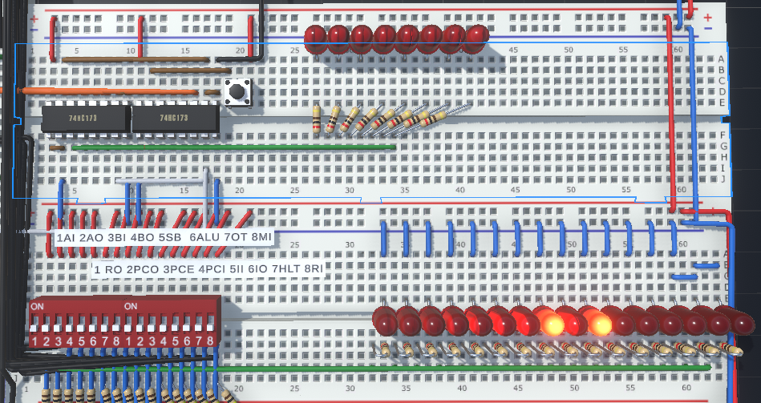

# TTL-74-Turing-Computer

An 8-bit computer built from scratch using 74HC series logic chips, aiming for Turing completeness.  

This is a personal learning project designed to deepen understanding of computer architecture, digital logic, and CPU design.


## Project Context📄

This project came from my first-year university studies, when I encountered topics such as logic gates and circuit board soldering, which I found really interesting.

To better prepare for second-year university courses, I plan to finish building a Turing complete computer before the semester begins.

The 74HC series chips were chosen because they are easier to demonstrate and assemble on breadboards and perfboards. The entire project will not use any external CPU or microcontroller to control its functional modules.

## Goal🎯🎯🎯

Completing the basic computer design

Achieving full Turing Completeness

### Turing Completeness

- Arithmetic and logic operations

- Conditional branching

- Jump (loop)

- Read/write memory
  
- Completing the implementation of the following code
  ``` pseudo-code
    while( x != 0 ){
      x = x - 1
    }
    ```

### Milestone📍

- [x] Complete the design in the simulation software.
   - Simulating circuits in 3D using Crumb
  - > Crumb is a 3D simulation software that is capable enough for circuit simulation, which helps reduce the cost of purchasing physical chips. However, it has some drawbacks: the complexity it can handle is limited, the available component scale is insufficient, and it lacks specialized features for detailed functions.
    
- [x] Turing Complete - Virtual
   - Testing Turing completeness in the Crumb simulator

- [ ] Soldering on the perfboards
   - Implementing the virtual circuit design in real hardware
      
- [ ] Turing Complete - Reality
   - Testing Turing completeness on physical hardware
      
- [ ] Expand more functions🛠️

## System Architecture⚙️

### Overall Design📄

**Data/Address Bus - 8-bit**

**Framework** : Von Neumann computer architecture
> Von Neumann computer architecture - Programs and data are stored in the same memory. The CPU reads instructions and data from this memory, and then executes the instructions step by step.
  
### System Concept Diagram✏️
<div align="center">
  
</div>

### Module Composition
| Module | Function |
|----------|----------|
|Power|The device is powered by 5V.|
|CLock|A 555 timer generates variable clock frequencies, while buttons provide manual input signals. |
|Instruction Counter|An output register is used as the address register to keep track of the execution progress.|
|Address Register|Programs are stored in the 74HC189 RAM, which uses 4-bit input/output and is organized as 15 rows of 8-bit data.|
|Program Editor|Use a switch to select between manual input and bus input, and modify RAM data through the 4-bit input coordinate with 8-bit data width|
|Instruction Register|Temporarily stores the bus data.|
|Instruction Decoder - Position|Obtain the first 4 bits from the instruction register and combine them with the 4-bit counter to form an 8-bit address.|
|Instruction Decoder - Output|Use the AT28C16 to read data via this address and output the 8-bit data onto the bus.|
|Register A|It can store 8-bit data, be connected to the ALU, and output data to the bus.|
|Register B|It can store 8-bit data, be connected to the ALU, and output data to the bus.|
|ALU|Used for the arithmetic module, currently completed with addition and subtraction.|
|Zone bit|When the ALU module output is 0, the flag is set to 1.|
|Output Register|The data is automatically displayed on LEDs after being written to the register.|
|Contorl Panel|Controlling the input and output of all modules.|

> The bus is used for data transmission among all modules, but it is single-channel; multiple module outputs may cause conflicts, which can corrupt data.

## Instruction Set Design✏️

<details>
<summary>Control Module Display🕹️</summary>
  
<div align="center">
  
</div>

>Control from left to right in this order:
>
>Register A input | Register A out | Register B input | Register B out | ALU Subtraction on or off | 
>ALU out | Output Register input | Address Register input | Address Register out | Instruction Counter out | 
>Instruction Counter add 1 | Instruction Counter input | Instruction Register input | Instruction Register out | Stop Time | Address Register input 

</details>

### 16-bit signal code📜
The control module controls the inputs and outputs of other modules based on 16-bit binary inputs.
| Full name of the function | Code | 16-bit siganl | Effect |
|---------------------------|------|---------------|--------|
|Register A input|AI|1000000000000000|INPUT
|Register A out|AO|0100000000000000|OUTPUT
|Register B input|BI|0010000000000000|INPUT
|Register B out|BO|0001000000000000|OUTPUT
|ALU Subtraction on or off|SB|0000100000000000|SYSTEM
|ALU out|ALU|0000010000000000|OUTPUT
|Output Register input|OT|0000001000000000|INPUT
|Address Register input|MI|0000000100000000|INPUT/SYSTEM
|Address Register out|RO|0000000010000000|OUTPUT
|Instruction Counter out|PCO|0000000001000000|OUTPUT/SYSTEM
|Instruction Counter add 1|PCE|0000000000100000|SYSTEM
|Instruction Counter input|PCI|0000000000010000|INPUT/SYSTEM
|Instruction Register input|II|0000000000001000|INPUT/SYSTEM
|Instruction Register out|IO|0000000000000100|OUTPUT/SYSTEM
|Stop Time|HLT|0000000000000010|SYSTEM
|Address Register input|RI|0000000000000001|INPUT

### Program Counter📄
The instruction is decoded into 15 separate control signals by the instruction decoder. These signals are generated in parallel within the decoder, using a 16-bit control word divided into segments.

The last 4 bits of the machine code are used to control the first three instructions (this is a mandatory requirement). These instructions manage the increment of the program counter and the transfer of the instruction to the instruction register.

> The design of machine code : XXXX-function attribute  YYY-Program counter

| XXXX0YYY | Code | Signal |
|----------|------|--------|
|xxxx0000| POC MI |00000001 01000000|
|xxxx0001| RO II |00000000 10001000|
|xxxx0010| PEC |00000000 00100000|

### Machine Code Instruciton

AT28C16 address converted to XXXXYYYY  
> XXXX represents the function attribute  
> YYYY represents the address or number

The AT28C16 is addressed with the pattern 000ZXXXX, and the data read from it is used to output the corresponding input/output control signals to the functional modules.
> Z used for toggling the flag
> XXXX used for functional address

Since the AT28C16 can only output 8 bits of data, but the control module requires 16 bits, two AT28C16 chips are connected in parallel, with their address inputs connected together.
> The 16-bit model outputs the first 8 bits and the last 8 bits separately.

| Effect | Code |Address|16-bit siganl|
|--------|------|-------|-------------|
|OUT|AO OT|0000|01000010 00000000|
|LOAD A|IO MI <br> RO AI|0001|00000001 00000100 <br> 10000000 10000000|
|ADD A|IO MI <br> RO BI <br> ALU AI|0010|00000001 00000100 <br> 00100000 10000000 <br> 10000100 00000000|
|SUB A|IO MI <br> RO BI <br> ALU AI SB|0011|00000001 00000100 <br> 00100000 10000000 <br> 10011100 00000000|
|ST A|IO MI <br> AO RI|0100|00000001 00000100 <br> 01000000 00000001|
|LOAD I|IO AI|0101|10000000 00000100|
|JMP|PIC IO|0110|00000000 00000100|
...
|FRZZ TIME|HLT|1111|00000000 00000010|


## The Future and the Plan
(2026)
<details>
<summary>August</summary>

- August 15 ~ 20
  - Research and study background and Principles✅
    
- August 22
  - Think and learn how to use Crumb✅
  - Learning the pin usage of 74HC173 and 74HC245✅
    
- August 23
  -  Using Crumb to build adders and registers✅
  > Build using OR, AND and XOR
  
- August 24
  -  First time trying to build an **instruction classifier**✅
  > **Instruction Classifier** : Used to split the 4-bit input instruction into 15 individual control units
  
- August 25 ~ 26
  - Decided to use the **von Neumann architecture**✅
  - Build register A and register B✅
  - Build ALU✅
    
- August 27
  - Building a clock✅
  > Require implementation of manual and automatic switching
  
- August 28
  - Build the output register✅
  - Build the instruction register and instruction memory✅
    
- August 29
  - Implementing the program counter and instruction counter✅
    
- August 30
  - Build the control module✅
  - Design machine code✅
    
- August 31
  - Design a hexadecimal decoder and create a programming module✅
  - Creating the flag register✅
    
</details>

<details>
<summary>September</summary>
  
- September 1
  - Purchase 74HC chips and various auxiliary materials✅
    
- September 4~6
  - Upload to GitHub and edit the README🛠️

</details>

<details>
<summary>Next Step🔧</summary>
  
- Design the position of the chip on the perfboard🔬

- Soldering the circuit⛏️

- Edit test program

- Test run

</details>

<details>
<summary>Future Plan</summary>

- Extend the decoder's control module to support 16-bit to 24-bit content.
- Increase the memory module, expanding the 15-row memory to 31 rows memory

</details>


