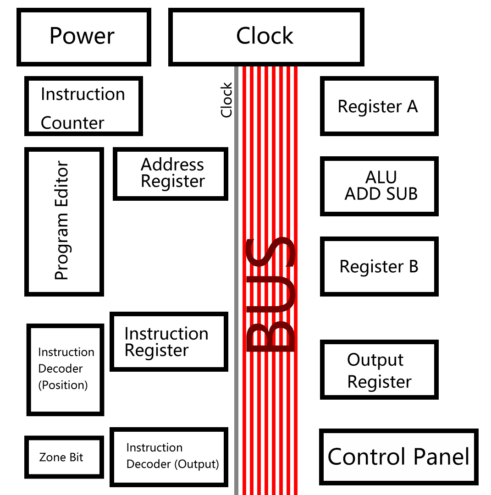

# TTL-74-Turing-Computer

An 8-bit computer built from scratch using 74HC series logic chips, aiming for Turing completeness.  

This is a personal learning project designed to deepen understanding of computer architecture, digital logic, and CPU design.


## Project Context📄

This project came from my first-year university studies, when I encountered topics such as logic gates and circuit board soldering, which I found really interesting.

To better prepare for second-year university courses, I plan to finish building a Turing complete computer before the semester begins.

The 74HC series chips were chosen because they are easier to demonstrate and assemble on breadboards and perfboards. The entire project will not use any external CPU or microcontroller to control its functional modules.

## Goal🎯🎯🎯
Completing the basic computer design

Achieving full Turing Completeness

### Turing Completeness

- Arithmetic and logic operations

- Conditional branching

- Jump (loop)

- Read/write memory
  
- Completing the implementation of the following code
  ``` pseudo-code
    while( x != 0 ){
      x = x - 1
    }
    ```

### Milestone📍

- [x] Complete the design in the simulation software.
   - Simulating circuits in 3D using Crumb
  - > Crumb is a 3D simulation software that is capable enough for circuit simulation, which helps reduce the cost of purchasing physical chips. However, it has some drawbacks: the complexity it can handle is limited, the available component scale is insufficient, and it lacks specialized features for detailed functions.
    
- [x] Turing Complete - Virtual
   - Testing Turing completeness in the Crumb simulator

- [ ] Soldering on the perfboards
   - Implementing the virtual circuit design in real hardware
      
- [ ] Turing Complete - Reality
   - Testing Turing completeness on physical hardware
      
- [ ] Expand more functions🛠️

## System Architecture⚙️

### Overall Design📄

**Data/Address Bus - 8-bit**

**Framework** : Von Neumann computer architecture
> Von Neumann computer architecture - Programs and data are stored in the same memory. The CPU reads instructions and data from this memory, and then executes the instructions step by step.
  
### System Concept Diagram✏️
<div align="center">
  
</div>

### Module Composition
| Module | Function |
|----------|----------|
|Power|The device is powered by 5V.|
|CLock|A 555 timer generates variable clock frequencies, while buttons provide manual input signals. |
|Instruction Counter|An output register is used as the address register to keep track of the execution progress.|
|Address Register|Programs are stored in the 74HC189 RAM, which uses 4-bit input/output and is organized as 15 rows of 8-bit data.|
|Program Editor|Use a switch to select between manual input and bus input, and modify RAM data through the 4-bit input coordinate with 8-bit data width|
|Instruction Register|Temporarily stores the bus data.|
|Instruction Decoder - Position|Obtain the first 4 bits from the instruction register and combine them with the 4-bit counter to form an 8-bit address.|
|Instruction Decoder - Output|Use the AT28C16 to read data via this address and output the 8-bit data onto the bus.|
|Register A|It can store 8-bit data, be connected to the ALU, and output data to the bus.|
|Register B|It can store 8-bit data, be connected to the ALU, and output data to the bus.|
|ALU|Used for the arithmetic module, currently completed with addition and subtraction.|
|Zone bit|When the ALU module output is 0, the flag is set to 1.|
|Output Register|The data is automatically displayed on LEDs after being written to the register.|
|Contorl Panel|Controlling the input and output of all modules.|

> The bus is used for data transmission among all modules, but it is single-channel; multiple module outputs may cause conflicts, which can corrupt data.


